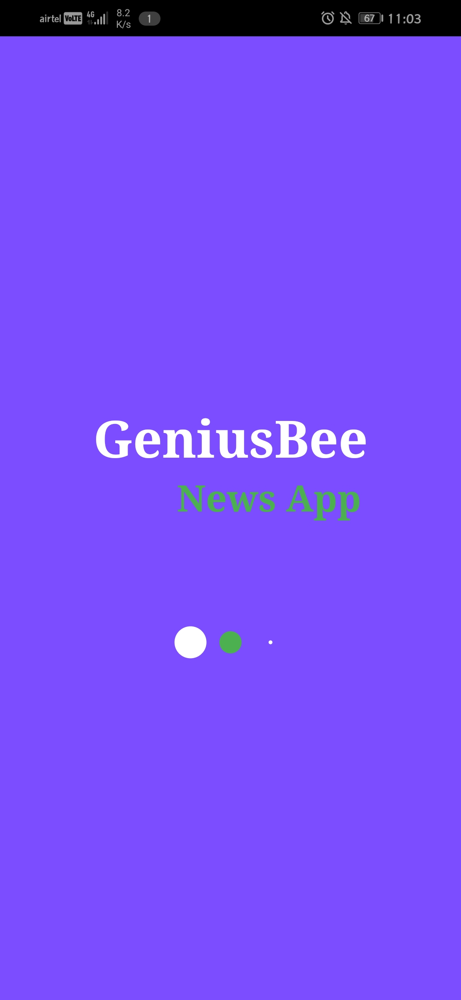
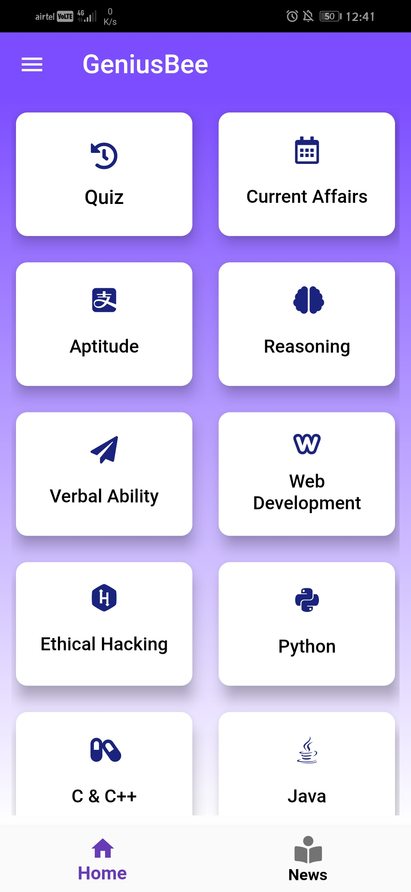
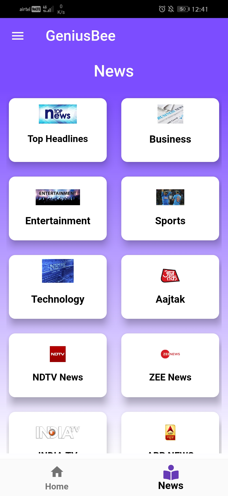
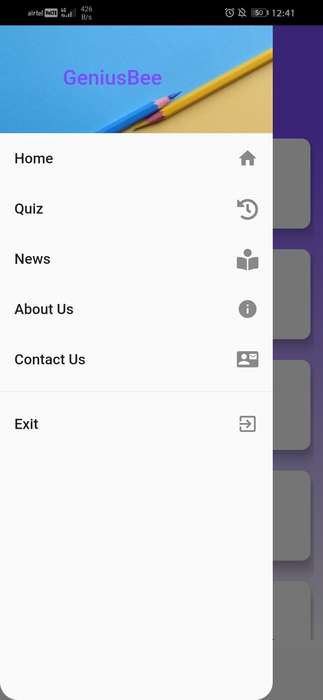

## GeniusBee

A new Flutter project.
## Getting Started

This project is a starting point for a Flutter application.

 Updated 1 minute ago
GeniusBee application is News, Tutorial and Quiz Application. GeniusBee provide different news source like Aajtak, ABP news, News 24, Patrika etc. and Tutorial like Android Development, web Development, Ethical Hacking and current affairs etc. . GeniusBee Application is hybrid application for Android and IOS. GeniusBee use flutter , dart, firebase and JSON.

geniusBee made By Nirmal Kukna.

### Some Screenshots

For help getting started with Flutter, view our
[online documentation](https://flutter.dev/docs), which offers tutorials,
samples, guidance on mobile development, and a full API reference.

# GeniusBee
# Geniusbee
